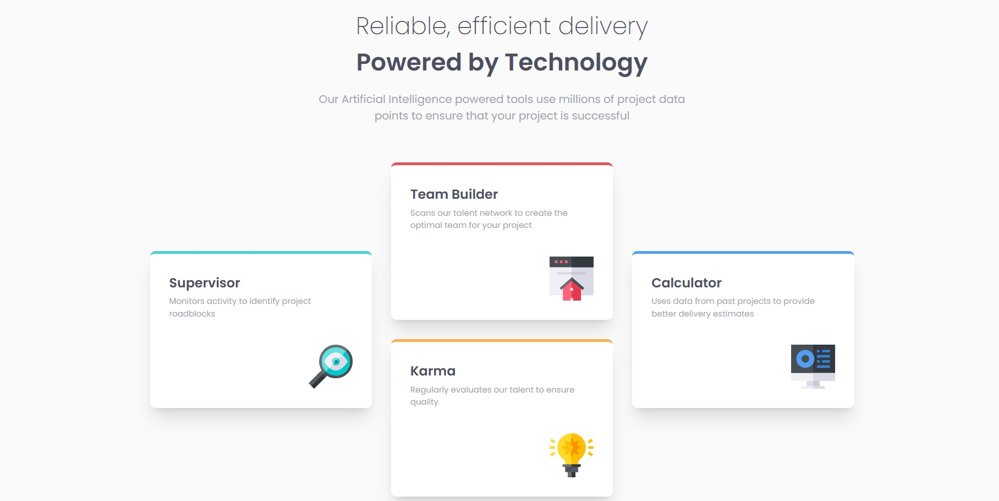

# Frontend Mentor - Four card feature section solution

This is a solution to the [Four card feature section challenge on Frontend Mentor](https://www.frontendmentor.io/challenges/four-card-feature-section-weK1eFYK). Frontend Mentor challenges help you improve your coding skills by building realistic projects. 

### Screenshot

### Links

- Solution URL: [https://github.com/Alexandru-Enescu/responsive-four-cards](https://github.com/Alexandru-Enescu/responsive-four-cards)
- Live Site URL: [https://alexandru-enescu.github.io/responsive-four-cards/](https://alexandru-enescu.github.io/responsive-four-cards/)

## Author

- Frontend Mentor - [@Alexandru-Enescu](https://www.frontendmentor.io/profile/Alexandru-Enescu)
- GitHub - [@Alexandru-Enescu](https://github.com/Alexandru-Enescu)
